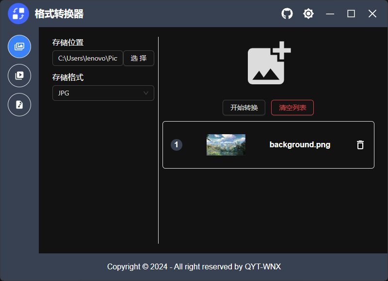

# format-convertor

> 基于Electron + FFmpeg的格式转换工具
>
> - 图片转换
> - 视频转换
> - 音频转换

---

## 图片转换

> - JPG
> - PNG
> - GIF
> - WEBP
> - TIFF
> - BMP

---

## 视频转换

> - MOV
> - MP4

---

## 音频转换

> - MP3
> - WAV

